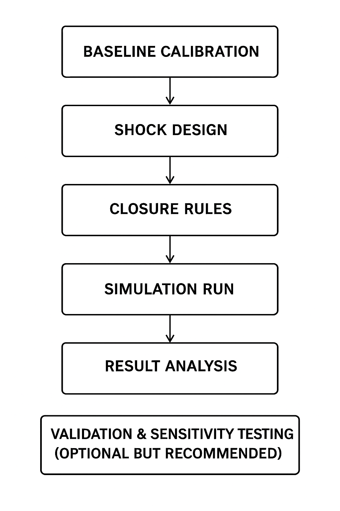

**Model Calibration**
The substitution elasticities used in the nested CES supply and demand functions are derived from a comprehensive review of the relevant literature. All other model parameters are calibrated to ensure the model exactly replicates the economic conditions of the reference year, 2017.

**Economic Rationale & Model Solution**
For each sector and region, the model determines total demand as the sum of final demand components—namely investment, household consumption, and exports—and intermediate inputs from all other sectors. This total demand is then allocated between domestically produced and imported goods based on the Armington assumption, which treats imports and domestic goods as imperfect substitutes.
Domestic production processes are represented by nested Constant Elasticity of Substitution (CES) functions, with nesting structures varying by sector. For instance, the production structure of the “other goods and services” sector is organized into four primary input aggregates: capital, labor, materials, and energy. At a lower nesting level, the material and energy aggregates are further disaggregated into individual inputs using additional CES functions.

**Software Required**
GAMS (General Algebraic Modeling System) is a high-level programming environment designed for modeling and solving complex mathematical optimization problems, particularly in economic modeling, energy systems, and general equilibrium analysis. It provides a flexible and efficient framework for formulating large-scale models with algebraic expressions and solving them using integrated solvers. GEMINI-E3 EU, the European version of the GEMINI-E3 model, is implemented in GAMS, leveraging its powerful capabilities to represent detailed economic structures, policy instruments, and environmental interactions. The use of GAMS facilitates transparency, scalability, and reproducibility in the model’s development and application.

**General Set Up for Simulations**
In the GEMINI-E3 model, simulations are set up following a structured sequence typical of Computable General Equilibrium (CGE) modeling. First, the model is calibrated to a base year using a detailed Social Accounting Matrix (SAM) that reflects observed economic flows among sectors, agents, and countries. For GEMINI-E3, this calibration is grounded in empirical databases such as GTAP and supplementary data sources like EDGAR and GAINS for environmental extensions. 
The model parameters—such as elasticities of substitution between production factors and between domestic and imported goods—are set so that the model exactly reproduces the economic equilibrium of the reference year. Once the baseline is established, a policy shock or external change is introduced, such as a carbon tax, trade liberalization, or energy transition policy. In GEMINI-E3, recent developments include introducing enhanced representations of air pollutant emissions linked to sectoral outputs, inputs, and household behaviors. 
The model closure must then be determined, specifying which macroeconomic variables (e.g., savings, investment, public deficits, trade balance) adjust to maintain equilibrium. GEMINI-E3 typically assumes flexible prices and full employment, though specific scenarios may alter labor market assumptions. After defining the shock and closure, the model solves for a new equilibrium by recalculating prices, outputs, incomes, and emissions until all markets simultaneously clear. 
Results are then compared to the baseline to assess impacts on key indicators like GDP, welfare, sectoral outputs, household incomes, and environmental emissions. 
Finally, sensitivity analyses are often conducted by varying key assumptions or parameters, enhancing the robustness of the policy conclusions. This structure allows GEMINI-E3 to deliver comprehensive and internally consistent insights into the economic and environmental effects of complex policy interventions.
In a schematic diagram, the general set up for simulations in GEMINI-E3 EU follows general set-up as other CGE models.

