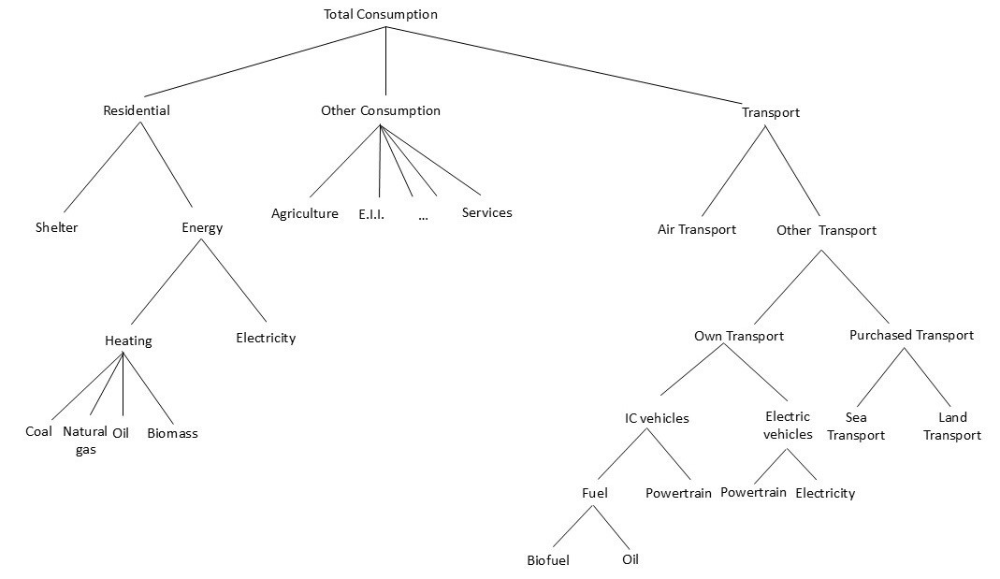

# Household Consumption Module

The household consumption module represents household demand for goods and services within the GEMINI-E3-EU framework. Household behaviour is modelled through a nested **Constant Elasticity of Substitution (CES)** consumption structure, allowing substitution between energy and non-energy goods in response to changes in prices, income, and climate policy measures.

Households allocate their disposable income across different consumption categories while maximising utility under budget constraints. The consumption structure captures substitution possibilities between energy carriers, transport fuels, electricity, and other commodities, enabling the model to assess behavioural responses to carbon pricing, energy taxation, and technological transitions.

**Household CES Struture**

The module includes consumption demand for:

  - Energy goods
  - Transport services
  - Industrial goods
  - Agricultural products
  - Service sectors
  - Electricity and heating services

The upgraded version of GEMINI-E3-EU also introduces household heterogeneity by distinguishing households across income categories. This extension improves the model’s ability to assess distributional impacts of climate and energy policies, including differences in consumption patterns, energy expenditures, and welfare effects across socio-economic groups.

Household consumption interacts directly with the production, energy, emissions, and labour market modules, contributing to the representation of economy-wide feedback mechanisms and long-term structural adjustment pathways.
