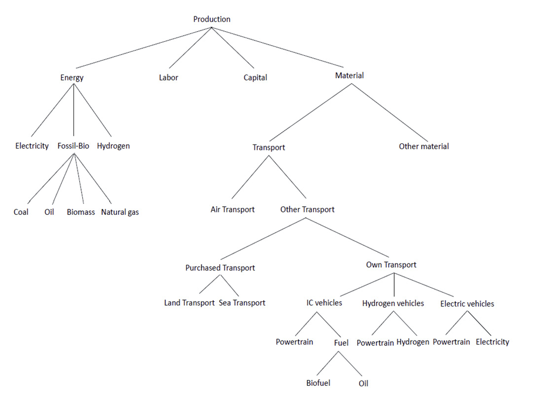

# Production Module

The production module of GEMINI-E3-EU represents producer behaviour under the assumptions of cost minimisation and perfect competition. Production activities are modelled using a nested **Constant Elasticity of Substitution (CES)** structure, allowing substitution between capital, labour, energy, and intermediate inputs in response to changes in relative prices, technological developments, and climate policy instruments.

At the highest level of the production structure, sectoral output is generated from a combination of value-added-energy composites and intermediate inputs. The value-added-energy bundle is then decomposed into labour, capital, and energy components through successive CES nests. Energy inputs are further disaggregated into fossil fuels, electricity, and other energy carriers, enabling representation of fuel and technology substitution.

**Nested CES production structure in GEMINI-E3-EU**

The production module distinguishes major economic sectors including:

  - Fossil fuel extraction
  - Electricity generation
  - Hydrogen production
  - Agriculture
  - Energy-intensive industries
  - Other manufacturing industries
  - Transport sectors
  - Service sectors

Electricity generation is represented with a more detailed technological structure, distinguishing fossil-fuel-based and renewable technologies, including coal, gas, oil, nuclear, hydro, solar, wind, and biofuel-based generation. The module also incorporates several technological upgrades introduced within the DIAMOND project, including hydrogen, biofuels, heat pumps, and Carbon Capture and Storage (CCS).

Sectoral production decisions interact with the emissions, labour market, international trade, and household consumption modules, allowing the model to capture economy-wide adjustment mechanisms and long-term structural transitions under alternative climate and energy policy scenarios.
